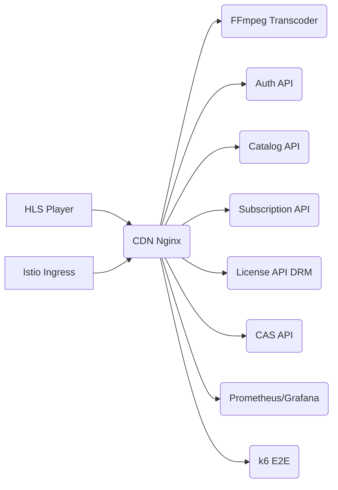
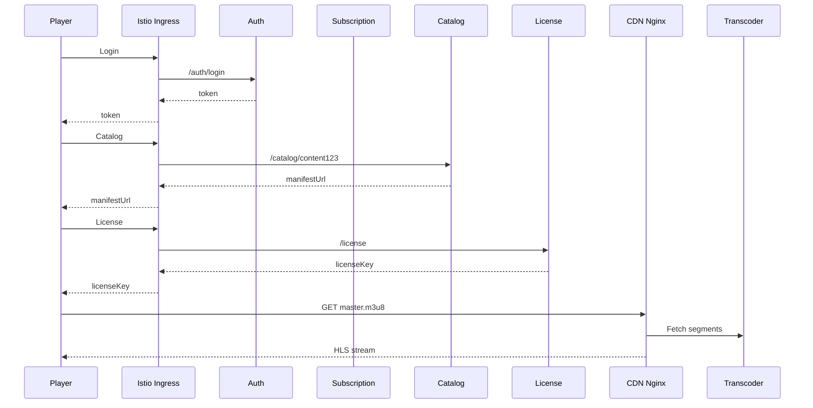

# OTT-K8s Lab v7

Plataforma OTT mínima para practicar despliegues Kubernetes "prod-like" con Istio, observabilidad y pruebas.

## Resumen
- APIs Python: auth, subscription, catalog, license (DRM), CAS.
- CDN edge Nginx con caché.
- Transcoder HLS estable (ffmpeg + nginx).
- Player HLS (hls.js) y pruebas k6.
- Prometheus + Grafana para métricas y dashboards.

## Requisitos
- Cluster Kubernetes local (**minikube** o **kind**).
- Herramientas: **kubectl**, **istioctl** v1.17+, **helm** 3.x.
- Opcional: stack de monitoreo tipo kube-prometheus-stack.

## Despliegue rápido
```bash
kubectl apply -f k8s/00-namespace.yaml
istioctl install -y --set profile=demo
kubectl label ns ott-platform istio-injection=enabled --overwrite
kubectl apply -f k8s/monitoring/
kubectl apply -f k8s/apis/ -f k8s/cdn/ -f k8s/vlc/ -f k8s/istio/
kubectl apply -f k8s/player/
kubectl apply -f k8s/testing/
kubectl logs -n ott-platform job/ott-load-test -f
```

## Acceso a Prometheus y Grafana
```bash
kubectl -n monitoring port-forward svc/prometheus-k8s 9090:9090
kubectl -n monitoring port-forward svc/grafana 3000:3000
```

## Diagramas




## k6 E2E
Ejecutá y revisá métricas:
```bash
kubectl logs -n ott-platform job/ott-load-test -f
```
